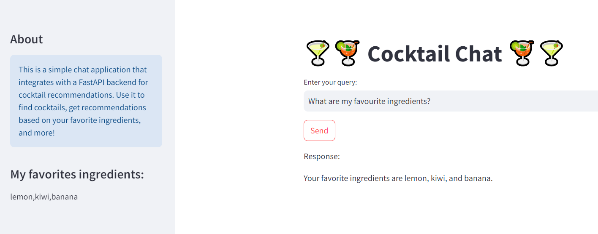

# 🍸🍹 Cocktail Chat 🍹🍸

This project is a Python-based chat application that integrates with a large language model (LLM) to create a Retrieval-Augmented Generation (RAG) system using a vector database. The application serves as a cocktail advisor, helping users with queries about cocktails and providing recommendations based on their preferences.

## Features

- **Knowledge Base Queries**:
  - Find cocktails containing specific ingredients.
  - List non-alcoholic cocktails with specific characteristics.
  - Retrieve information about user-specified favorite ingredients.

- **Cocktail Advisor**:
  - Recommend cocktails based on user preferences.
  - Suggest cocktails similar to a specified cocktail.

- **Interactive Chat Interface**:
  - User-friendly chat interface using **Streamlit**.
  - FastAPI backend for robust and efficient API handling.

## Technologies Used

- **Python**: Core language for development.
- **LangChain**: Framework for building applications with large language models (LLMs).
- **OpenAI GPT**: Utilized for generating natural language responses.
- **FAISS**: Vector database for efficient similarity search and clustering.
- **OpenAI Embeddings**: For generating dense vector embeddings of cocktail data.
- **Streamlit**: Frontend interface for user interaction.
- **FastAPI**: Backend framework for managing the API.
- **Pandas**: For data preprocessing and manipulation.

## Use Cases


1. **Knowledge Base**:
   - *Example Queries*:
     - "What are the 5 cocktails containing lemon?"
     - "What are the 5 non-alcoholic cocktails containing sugar?"
     - "What are my favorite ingredients?"

    

2. **Advisor**:
   - *Example Queries*:
     - "Recommend 5 cocktails that contain my favorite ingredients."
     - "Recommend a cocktail similar to 'Hot Creamy Bush'."

## FastAPI docs

## Setup and Installation

### Prerequisites
- Python 3.8 or later.
- OpenAI API key.
- Dataset: Download the cocktail dataset from [Kaggle](https://www.kaggle.com/datasets/aadyasingh55/cocktails)
into coctails/final_coctails.csv


### Clone the Repository
```bash
git clone https://github.com/Yevheniia-Ilchenko/Cocktail-chat
cd cocktail-advisor-chat
```
### Create a .env file
Create a .env file in the project root and add the following:

```bash
OPENAI_API_KEY=your-openai-api-key
```

### Install Dependencies
```bash
pip install -r requirements.txt
```

### Running the Application
```bash
python run_app.py
```
